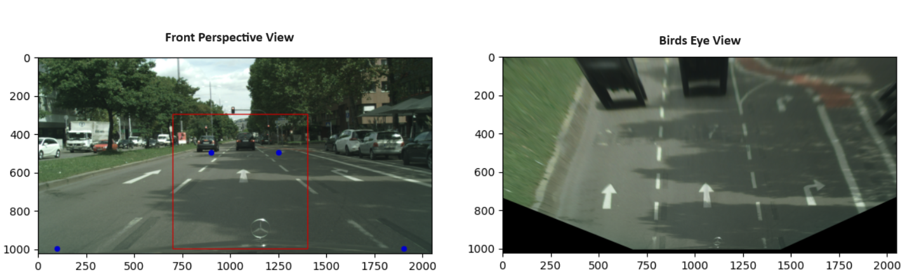
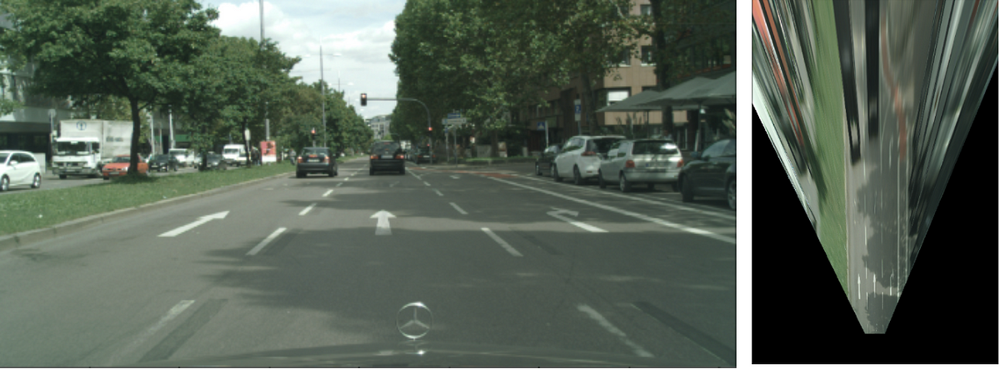
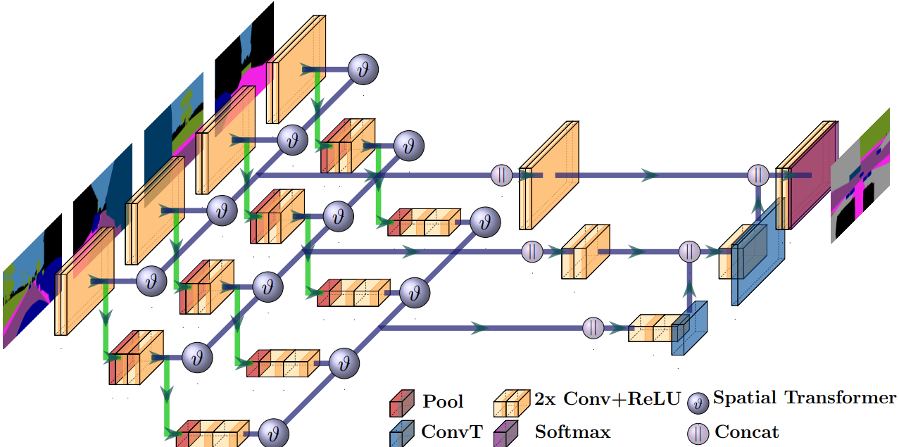
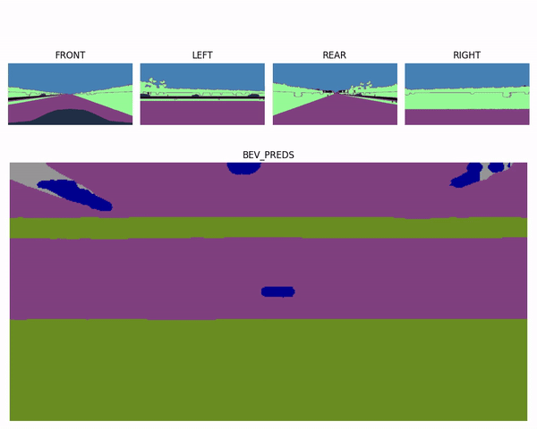
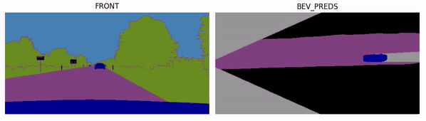

# Birds Eye View
- BEV (Birds Eye View) is nothing but a top-down view of the physical world . It’s mostly expressed in
euclidean space (in metres), and can be a 2D / 3D coordinate frame.
- Among Camera-only solutions, Birdseye view (BEV) based approaches have almost been the
go-to approach, as seen in the [nuScenes Camera only 3D Object detection leaderboard](https://paperswithcode.com/sota/3d-object-detection-on-nuscenes-camera-only)
- Post 2021, when Tesla switched to Hydranets, Camera-only solutions are becoming more and more
popular. 
- **NOTE**: The work is more of literature survey of the different approaches, and is aimed at providing consolidated information for anyone looking to foray into this domain. Kindly refer to License usage on the particulare repo / paper before using for any other purpose

## Agenda
- [BEV Overview](#bev-overview)
- [Advantages](#advantages)
- [BEV Approaches](#bev-approaches)
- [Inverse Perspective Mapping](#inverse-perspective-mapping)
- [Cam2BEV - Deep Learning Example](#cam2bev---deep-learning-example)
- [BEV_references](#bev_references)

## BEV Overview
- [BirdsEyeView](BirdsEyeView.pdf) is summary of literature review on Birds Eye View, classification taxonomy, traditional approaches, Deep Learning approaches, use cases for Autonomous Driving tasks with examples

## Advantages
BEV offers following advatnages over the traditional PV (Perspective View):
- **No scale problem** - Scale problem refers to the issue of objects of same size, appearing
differently, based on the distance from the camera. This consistent relationship with the 3D
world makes the algorithm robust and generalized.
- **Occlusion representation** - Representing objects with occlusion or cross traffic is easier in
BEV space. Also, It is convenient for subsequent modules (e.g. planning, control) to develop
and deploy. The methods to get to BEV space are flexible in that you can use them to cover
part of the entire FOV, or entire 360 degree based on the application.
- **Fusion opportunities** - As we’ll explore in later stages of the blog, BEV space serves a more
direct method for Spatial as well as Spatio-Temporal fusion, particularly, Lidar-Camera fusion

## BEV Approaches
In the context of Self-driving cars, Cameras, Lidars and Radars are the commonly used Perception
sensors. Among these, Camera and Lidar have attracted a lot of research among Deep Learning
enthusiasts. Camera sensors operate mostly in 2D Image plane, whereas Lidars operate in 3D space.
On the other hand, images capture more semantic information, compared to sparse point clouds.
The methods to process the sensor data varies significantly due to the inherent contrasting nature of
sensor data. Hence, its sensible to categorise the methods based on the sensor modalities as follows:
- BEV Camera
- BEV Lidar
- BEV Fusion

We'll look into couple of approaches, one using Traditional Computer Vision and another using Deep Learning.

## Inverse Perspective Mapping
- The method of producing a birds-eye view image of the scene from the front-facing image plane is referred to as **Inverse Perspective Mapping (IPM)**. Assuming the world to be flat on a plane, we need to map each pixel on image to a point on a 2D plane.
- In [BEV Traditional](notebooks/bev-traditional.ipynb) notebook, we go through the math to convert a PV (Perspective View) to BEV.

- Variants of IPM have used for Lane detection. But their performance depends on how well the following assumptions hold true
    - Flat road surface assumption. Any deviation would produce artefacts / distortions
    - Zero height object assumption. Objects with height would appear distorted / warped in BEV output
    - IPM works well only in areas, closer to ego vehicle
    - IPM works well only for static objects. So, dynamic objects are generally filtered before computing the Homography transformation

- Refer to [BEV_references](BEV_references.md) for more resources related to IPM

## Cam2BEV - Deep Learning Example
- [Cam2BEV](https://browse.arxiv.org/pdf/2005.04078.pdf) makes use of Spatial Transformer modules to learn the mapping from PV to BEV. It provides a simple, yet efficient framework to convert
    - A single front-facing image to BEV image
    - Combine multiple front-facing images to get 360 degree BEV image
- UNetXST, the model in the paper, is derived from the UNet model, which was developed for Biomedical Image Segmentation. It’s similar to the UNet model in following ways:
     - CNN model - It uses Convolution + MaxPooling blocks to extract features
     - Encoder-Decoder architecture - The input is downsampled for `n` times in the encoder, while being upsampled in the decoder
     - Skip-connections - Feature map from the encoder is concatenated at each layer in decoder, to improve boundaries segmentation

- In [Cam2BEV UNetXst notebook](notebooks/cam2bev-unetxst-pytorch.ipynb), we define the UNetXst model from scratch, understand different modules, and finally, get a network that can predict the BEV image from 4 PV camera images

- In [Cam2BEV UNetXst Front notebook](notebooks/cam2bev-front-unetxst-pytorch.ipynb), we train the same model to convert a single Front facing image to BEV. 

- References
   - [Cam2BEV official Tensorflow implementation](https://github.com/ika-rwth-aachen/Cam2BEV)
   - [Cam2BEV pytorch implementation](https://github.com/AlaaBenZekri/Cam2EBV/tree/main)

## [BEV_references](BEV_references.md)