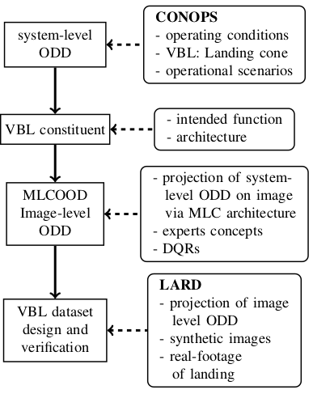
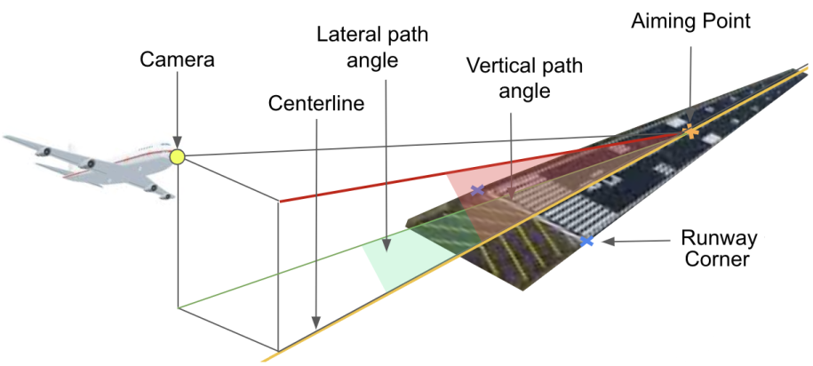
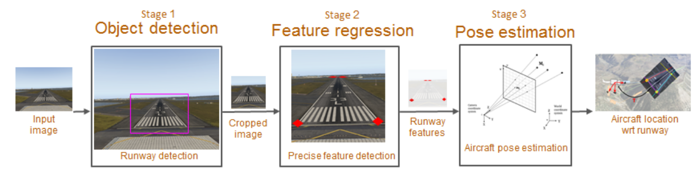

# [How to design a dataset compliant with an ML-based system ODD?](papers/designing_odd_compliant_dataset.pdf)

## Abstract
- Design and validation of dataset compliant with ODD of ML system (for Vision-based Landing task)
- Establishes ODD at both system and image levels
- Shows example of translating system requirements to image level properties, which leads to DQT (Data Quality Requirements)
- Uses LARD (Landing Approach Runway Detection) dataset as example (contains both synthetic and real footage)
- This paper focuses on Aerospace standards, with references to Automotive standards, about verification methodologies applicable to systems involving ML systems

## Introduction

### Certification Guidelines
- Multiple working groups, for introducing standards related to certifying ML-based systems for safety critical applications (References 1-5)
- Rely on existing standards (ED-79/ARP-4754A [6], for integration of ML-based function at subsystem level, the ED-12C/DO-178C [7] and the ED-80/DO-254 [8], related to deployment of the ML models onto respectively software and hardware items)
- Data-driven development introduces new processes: 
    - Data management process - produce dataset where internal features match intended function (must be designed to fit ODD - Operational Design Domain)

### Motivation
- Vision-based landing task - compute position of aircraft relative to runway based on camera images
- No existing dataset led to LARD (Landing Approach Runway Detection) dataset
- Synthetic data generators - Google Earth Studio and Microsoft Flight simulators, YouTube videos as great sources

### Approach
- Designing dataset, based on system ODD and CONOPS (Concept of Operations)
- System ODD = Landing appraoch geometryof aircraft and standard runway markings
- MLC (ML constituent, b/w system and item layers). MLC = item or container of items, should contain at least 1 ML model and items, supporting inference of the model

1. Define system level ODD (operating environment) for intended function
2. Arrive at expected properties for ML task. Outcome: dataset properties, DQRs (dataset Quality requirements)
3. Strtegy to arrive at dataset, meeting DQR
4. Iterate steps 1-3

## System level ODD

### ODD concept
- ODD = Operating condidionts in which system is designed to operate (from SAEJ3016 - Automotive industry)
- SOTIF (ISO 21448) - focues on safety considerations, whicle integrating ODD
- ISO 34503, focusses on requirements for ODD definition, differentiates ODD from TOD (Target Operating Domain), which is not specifiable, but the one, where vehicle operates
- System must detect, whether its inside / oustide ODD and deactivate, if required (Operational scenario concept)
- In Aerospace industry, ODD applies only to ML constituent

### Operating environment
- SME (Subject Matter experts) define CONOPS (operating conditions, environment)

### VBL system level ODD
- ODD includes evniornmental, weather conditions (wind, temperature, visibility, precipitation, sensor noise), operational terrain (runway sloper, runway roughness), infrastrucutre (fixed obstacles)
- Can easily become infinite. To make it possible, constrain to possible situations, that need to be handled by humans
- Concept of General Landing approach cone, in civil aircraft landings

- Runway markings (standardized)
    - landing threshold (first line at atsrt of runway)
    - piano (pattern of stripes)
    - runway identifiers
- Aiming point (300m from landing threshold)

- Position of aricraft wrt runway - 3 parameters
    - along track distance (projected distance of nose of plane on centerline of runway and aiming point)
    - Lateral path angle
    - Vertical path angle
- Attitude of airfacrt is defined by Euler angles (rpy)

### Definition 1
**A generic landing approach cone is the set of all pairs ⟨positions,attitude⟩ within the ranges of the 6 parameters of Table I.**

- Apart from cone specifications, can define scenarios with commonly observer maneuvers
    - real traffic observations

### ODD 1
**The VBL system must permit the landing as long as the aircraft is in the generic landing approach cone.**

## VBL ML constituent

### Intended function 1
- Pose estimation of the aircraft with respect to the airport runway when the aircraft flies within the generic landing approach cone. The pose is estimated from several sensors, including a camera positioned at the aircraft’s nose and directly facing the runway during the landing.
- ML architecture should satisfy intended function

- Stages
    - Object detection stage - compute Bounding box, around runway, crop it (**VBRD**)
    - compute 4 corners of runway
    - Pose identification using non ML approach
- All MLC components intended functions and performances, shoudl ensure MLC intedned function fulfills system requirements
- Model should identify one or more runways (1 unique class)
- `We expect the output of the stage-1 to select the runway on which the aircraft must land. An object detector, without any further support, will hardly be capable of selecting the target runway, in particular when there are parallel runways. To simplify the task, we decided to restrict the intended function and thus the ODD to have a unique runway on the image`

### ODD 2
- Restrict ODD of intended function 1
    - The aircraft is landing on airports with a piano
    - There exists only one runway for which current position is considered within the approach cone5
    - The runway is fully visible on the image (no occlusion)
- Such restriction should be fed back to system, for negotiation and update on system architecture / operating conditions
- The detector should localized the object within image, by providing bounding box candidates around said object (x pixels on each side)

### ODD 3
- The ODD is the infinite set of all images that could be seen during a landing on an (extremely large) set of airport runways.

## Image Level ODD

