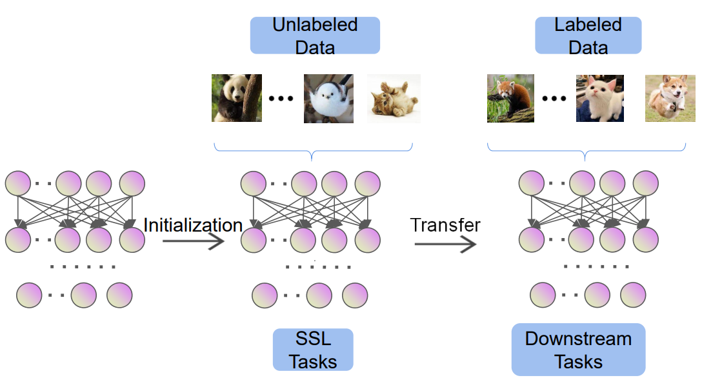
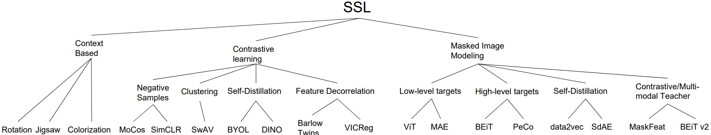
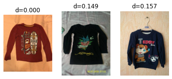
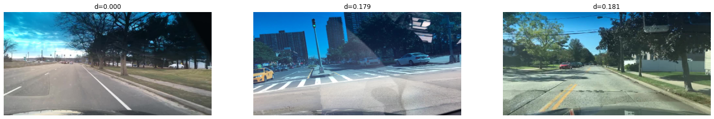

## Contents
- [Why do we need SSL?](#why-do-we-need-ssl)
- [Overview](#overview)
- [Advantages](#advantages)
- [Training Example](#training-example)
- [Self-supervised Learning vs Supervised learning](#cam2bev---deep-learning-example)
- [SSL_references](#ssl_references)

## Why do we need SSL?
- Self-driving cars need to drive billions of kms before they can surpass human driving capabilities. The quality of those kilometres also matters – it must involve complex driving scenarios, including  pedestrians, drivers, other participants, different weather conditions etc. If we relied on supervised learning alone, where we manually label all those sensor data, it’d take zillion more years for us to  reach Level 5 autonomy.
- True, we have nuScenes, Waymo, Argoverse and many other datasets, focussed on Self-driving cars. But, even their size (~100 hour) is significantly lesser than what modern deep learning algorithms demand. 
- The cost associated with annotation and verification of such complex dataset is also very high. There are multiple cameras, lidar point clouds, and in some cases radar, which need to be labelled w.r.t space and time, and for multiple applications – Object Detection, instance segmentation, Semantic 
segmentation etc. It’s almost impossible to scale certain tasks like Point Cloud segmentation, without some kind of intelligence / automation. 
- This is where Non supervised learning methods play a crucial role. There are giant strides made in Unsupervised, Self-Supervised, Semi-supervised, Weakly supervised learning methods. Each of these methods have its own set of advantages and disadvantages. We’ll focus on Self-Supervised Learning (SSL) in this post
- **NOTE**: The work is more of literature survey of the different approaches, and is aimed at providing consolidated information for anyone looking to foray into this domain. Kindly refer to License usage on the particulare repo / paper before using for any other purpose

# Self-Supervised Learning Overview
- Self-Supervised Learning (SSL) is method where model / algorithms are trained without manually annotated labels. It’s different from Unsupervised learning, where there are no labels to begin with. 
-In Self-supervised learning, training data is generated by exploiting the inherent structure or relationships within the data, enhancing their adaptability to diverse and real-world driving conditions.

- [Image reference](https://arxiv.org/pdf/2301.05712.pdf)

- [Self-Supervised Learning](Self-Supervised-Learning.pdf) is summary of literature review on SSL, classification taxonomy, use cases for Autonomous Driving tasks with examples

- [Image reference](https://arxiv.org/pdf/2301.05712.pdf)

## Training Example
- In [ssl-simclr-r50-clothing](notebooks/ssl-simclr-r50-clothing.ipynb) notebook, we train a SimCLR (Simple framework for Contrastive Learning) model with Resnet50 backbone on clothing dataset
- [lightly library](https://github.com/lightly-ai/lightly) is used for defining the **NTXentLoss function** and **SimCLR projection head**
- Apart from the loss function, we also monitor the `Std.dev of predicted features` to avoid **feature collapse**, a scenario where the model predicts the same output for all inputs. It occurs predicted features have low-rank
- We also visualize the K-nearest neighbours in the dataset, which demonstrates that model has learnt to differentiate shirts from shoes, other kinds of apparel

- In [ssl-simclr-r50-bdd100k](notebooks/ssl-simclr-r50-bdd100k.ipynb) notebook, we train a SimCLR (Simple framework for Contrastive Learning) model with Resnet50 backbone on BDD100K dataset. 
- After training, the model is able to differentiate b/w different scenarios in the dataset.

## Self-supervised Learning vs Supervised learning
- Following methods are used to evaluate Self-supervised models
    - K-Nearest Neighbours
    - Probing (Linear / MLP)
    - Downstream task evaluation
- We covered the KNN approach in previous [Training example section](#training-example). Its simple, efficient and the more interpretable way to look at features learned by model
- Probing techniques involve, training a single (linear) / MLP (non-linear) layer(s) on top of the pretrained backbone on downstream dataset with labels and use accuray / any classification metric for comparison
- Downstream Task evaluation involves training a model with pretrained backbone on downstream dataset with labels and use the task metric for comparison. In this work, we're using **Semantic Segmentation** as downstream task and **resnet50 backbone**
- In [deeplabv3-resnet50-cityscapes](notebooks/deeplabv3-resnet50-cityscapes.ipynb) notebook, we use a standard resnet50 backbone with dilations (pretrained on Imagenet)  with deeplab v3+ decoder on Cityscapes dataset. With the **supervised trained resnet50**, we obtain final mean IoU of **69% on validation set**, after training for 12 epochs, and final mean IoU of 66.66% on test set
- In [ssl-deeplabv3-resnet50-cityscapes](notebooks/ssl-deeplabv3-resnet50-cityscapes.ipynb) notebook, we use a resnet50 backbone from **DINO**, which is trained self-supervised on Imagenet with. With this backbone, we obtain **mean IoU of 73% on validation set, after training fro 11 epochs, and final mean IoU of 71.22% on test set**
- So, just by changing the backbone alone, we get additional (71.22 - 66.66) = 4.56mIOU, a 6.8% improvement, with 1 less epoch.
- Alternatively, we achieve 69% mIOU on val set in just 6 epochs. So, if we have that as target, we reach it in 6 less epochs. Hence, we can say that SSL features generalize better than supervised counterparts.

## [SSL_references](SSL_references.md)
- [SSL cookbook](https://arxiv.org/pdf/2304.12210.pdf) 
- [ECCV 2022 ssl tutorial github](https://gidariss.github.io/ssl-on-wheels-eccv2022/)
- [SSL literature survey](https://arxiv.org/pdf/2301.05712.pdf)
- [SSL - self prediction & contrastive learnign NeurIPS tutorial 2021](https://nips.cc/media/neurips-2021/Slides/21895.pdf)
- [Towards Good Practices in Self-supervised Representation Learning](https://assets.amazon.science/f8/bb/520157fc4679984721dea85cc690/towards-good-practices-in-self-supervised-representation-learning.pdf) 

are some of the resources, that were very helpful during this study