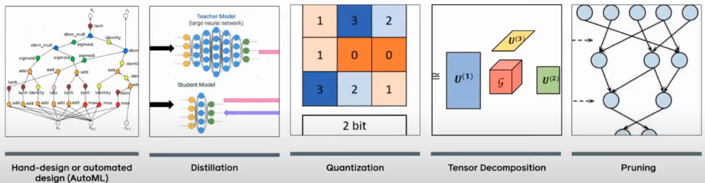

# Deploying TensorRT Engine on NVIDIA GPU

## Problem statement
- Run deep learning models efficiently at runtime on embedded platforms (only platforms with NVIDIA GPUs in this document scope)
- Meet latency requirements for safety critical applications

## Overview
- Introduction
- Deployment options
- Pre-requisites for Tensorrt deployment
- Tensorrt deployment workflow
- Appendix
    - TensorRT optimization techniques
- References

## Introduction
- Deep Learning models, getting larger, while there is increased focus on edge-computing for various applications
- Performance targets b/w training and inference differ significantly
    - Training
        - can consume large memory, super high compute GPU platforms (multi-GPU), no strict restriction on latency
    - Inference
        - Limited memory, strict latency requirements, limited compute (embedded GPU), energy consumption, environment limitations (temperature)
- Model optimization, for inference is critical, and can be classified into 4 categories



- [Image source](https://www.youtube.com/watch?v=f86hkOGoX54)
- Advantages
    - Reduced memory footprint requirements on device
    - Faster inference time, reducing latency (=> more real-time solutions)
    - Reduced energy consumption ( => increased battery life)
    - Lower clock speed requirements

## Deployment options
- General workflow
    - Train a model using DL framework (PyTorch / TF)
    - Convert the model to desired format
    - Use deployment option for inference


- [Image source](https://docs.nvidia.com/deeplearning/tensorrt/latest/getting-started/quick-start-guide.html)
- Two categories for classification
    - Programming language (C++ vs Python)
    - Model type
        - Framework (Tensorflow (.pb) / Pytorch (.pth))
        - ONNX (Open Neural Network Exchange)
        - [Tensorrt](https://developer.nvidia.com/tensorrt) (NVIDIA GPUs)

### Python vs C++ Runtime
- Python API
    - Easier for deployment, debugging issues
    - Reuse pre and post processing transforms
    - More performance overhead
    - Make sure inference transforms are possible (on deployment Hardware)
- C++ API
    - C++ API support for more platforms (64-bit windows)
    - Multithreading possible. In Python, CPython can use only 1 system thread, due to GIL
    - Least overhead possible
    - [NVIDIA Thrust](https://developer.nvidia.com/thrust) provides GPU accelerated implementations of common operations like sort, scan, transform etc
    - Fine-grained control over the execution of model using a C++ interface, including memory allocation, kernel execution, and copies to and from the GPU explicit

### Torch-TensorRT
- [Torch-TensorRT](https://github.com/pytorch/TensorRT) provides model conversion and a high-level runtime API for converting PyTorch models.
- Torch-TensorRT conversion results in a PyTorch graph with TensorRT operations inserted into it.
- Falls back to PyTorch implementations where TensorRT does not support a particular operator.
- Common deployment is in python. C++ runtime using [libtorch](https://docs.pytorch.org/docs/stable/cpp_index.html) should be possible

### ONNX
- [ONNX](https://onnx.ai/) is an open, common format built to represent machine learning models. ONNX defines a common set of operators - the building blocks of machine learning and deep learning models - and a common file format use models with a variety of frameworks, tools, runtimes, and compilers.


### Tensorrt
- NVIDIA TensorRT is an SDK for optimizing trained deep-learning models to enable high-performance inference. TensorRT contains a deep learning inference optimizer and a runtime for execution.
- NVIDIA Tensorrt consists of two components
    - A series of parsers and integrations to convert your model to an optimized engine
    - An series of TensorRT runtime APIs with several associated tools for deployment.


- [Image source](https://www.youtube.com/watch?v=f86hkOGoX54)

## Prerequisites
- Assumtion: model is converted to ONNX format, to be deployed in an C++ application

### Hardware and Software Requirements
- **NVIDIA graphics card** with compute capability >=5.0
- **Ubuntu 20.04 or 22.04** OS
- **NVIDIA CUDA Toolkit** > 11.0 (12.0+ recommended)
- **cuDNN library** (version 8 or later, but less than 9 for OpenCV GPU compatibility)
- **CMake** >= 3.10
*   **OpenCV with CUDA support** (version 4.8+ recommended) for image preprocessing.

### Dependencies
- Tensorrt implementation (`libnvinfer`, `libnvonnxparser`, and `libnvparser` libraries), can be linked externally
- No official `find_package()` for Tenssort. Need custom implementation

### Model requirements
- Pre-processing and post-processing operations implemented in C++
- ONNX parser to be compatible with ONNX opset ()
    - If an ONNX model contains unsupported operators or has compatibility issues, the parser might fail (parser is backward compatible to specific ONNX opset)
- Non-native operations implemented as Tensorrt plugins
- **NOTE**
    - Engine file needs to be generated on platform with same SM as deployment hardware (A7Z1 contains embedded A2000 GPU, same as A10 series, g5dn instance in AWS)
    - [TensorRT Support Matrix](https://docs.nvidia.com/deeplearning/tensorrt/latest/getting-started/support-matrix.html)


## TensorRT Deployment Workflow
- Engine file generation (offline process)
- Logger and Builder Instantiation
- Deserializing plan
- Preprocessing
- Generate Engine and execution context
- Inference and Post processing

TensorRT provides interface classes for most operations.

### Engine file generation (only offline step)
- Engine (.engine / .plan extension) is serialized version of the Tensorrt inference graph
- It can be generated using 3 ways
    - trtexec
    - TensorRT API
    - Nsight Deep Learning Designer GUI
- For simple models, trtexec (comes part of TensorRT release) is sufficient
```bash
trtexec --onnx=<onnx model> --saveEngine=<output model>
```
- Options during plan generation
    - Precision (FP16 / FP8, INT8)
    - Maximum memory to be used during conversion
    - hardware compatibility mode (ampere -> ampere+)
    - Version compatibility (Tensorrt 8.6 -> Tensorrt 9)
- **Engine is specific to hardware, software** (Tensorrt version, batch size, precision)
- **NOTE** For more fine-grained control, use Tensorrt API

### Logger and Builder Instantiation
- `ILogger` implementation is required for `IBuilder` implementation
```cpp
class Logger : public nvinfer1::ILogger {
public:
    void log(Severity severity, const char* msg) noexcept override {
        // Suppress info-level messages, print warnings and errors
        if (severity <= Severity::kWARNING) {
            std::cout << msg << std::endl;
        }
    }
} logger;

IBuilder* builder = createInferBuilder(logger);
```
- Logger implementation must be thread-safe

### Deserializing plan
- Deserialize the TensorRT engine from a file. The file contents are read into a buffer and deserialized in memory.

```cpp
IRuntime* runtime = createInferRuntime(logger);
std::vector<char> modelData = readModelFromFile("model.plan");
ICudaEngine* engine = runtime->deserializeCudaEngine(modelData.data(), modelData.size());
```

### Preprocessing
- Implement pre-processing in C++, move data from CPU to GPU buffers
- Allocate CUDA memory for input, output buffers, generate a list of engine bindings.
- For Image processing, (resize, normalize, ToTensor operations, format conversion like HWC to CHW)
- For Point clouds, grouping into voxels, finding voxel mean, 
- `cudaMemcpyAsync` function, enables asynchronous copy b/w devices host and device (**host = CPU, Device = GPU**). There is synchronous version as well

```cpp
void* input_mem{nullptr};
cudaMalloc(&input_mem, input_size);

const std::vector<float> mean{0.485f, 0.456f, 0.406f};
const std::vector<float> stddev{0.229f, 0.224f, 0.225f};
auto input_image{util::RGBImageReader(input_filename, input_dims, mean, stddev)};
input_image.read();

// copy data from CPU to GPU
cudaStream_t stream;
auto input_buffer = input_image.process();
cudaMemcpyAsync(input_mem, input_buffer.get(), input_size, cudaMemcpyHostToDevice, stream);
```

### Generate Engine and execution context
- The engine holds the optimized model, but you must manage additional states for intermediate activations to perform inference. 
- A TensorRT execution context encapsulates execution state such as persistent device memory for holding intermediate activation tensors during inference.
- This object holds intermediate activations and allows an engine to be used for multiple overlapping inference tasks.

- Set 
```cpp
// create context
IExecutionContext *context = engine->createExecutionContext();

// set input memory shape
char const* input_name = "input";
auto input_dims = nvinfer1::Dims4{1, /* channels */ 3, height, width};
context->setInputShape(input_name, input_dims);
```

### Inference and Post processing
- Inference is execution executeV2 or enqueueV3 methods. After the execution, we copy the results to a host buffer and release all device memory allocations.

```cpp
// actual inference
bool status = context->enqueueV3(stream);

// get output memory size
char const* output_name = "output";
auto output_dims = context->getTensorShape(output_name);
auto output_size = util::getMemorySize(output_dims, sizeof(int64_t));
void* output_mem{nullptr};

// copy output from GPU to CPU
cudaMalloc(&output_mem, output_size);
auto output_buffer = std::unique_ptr<int64_t>{new int64_t[output_size]};
cudaMemcpyAsync(output_buffer.get(), output_mem, output_size, cudaMemcpyDeviceToHost, stream);

// use CUDA synchronization mechanisms to ensure computations are complete before accessing results.
cudaStreamSynchronize(stream);

// free memory
cudaFree(input_mem);
cudaFree(output_mem);
```
- Post Process the raw output (e.g., apply softmax, interpret classification results, or parse object detection bounding boxes). For very large outputs, post-processing can be done directly on the GPU using CUDA kernels for efficiency.


## Miscellaneous topics

### CUDA streams
- All commands within stream executed sequentially, but streams can run out of order
- Default stream = nullstream

### Output Types and Precision Settings (FP32, FP16, INT8)

TensorRT supports different precision modes for inference, allowing trade-offs between speed and accuracy.

- **FP32 (Full Precision)**
    - Default precision mode. 
    - Highest accuracy, slowest inference
    - No specific precision flags or calibrators for FP32.

- **FP16 (Half Precision)**
    - FP16 uses 16-bit floating-point numbers. 
    - Good balance between speed and accuracy, often resulting in significant speedups.
    - `BuilderFlag::kFP16` flag  required during `plan` generation
    - `Engine` class also supports FP16 output 

- **INT8 (8-bit Integer Precision)**
    - INT8 precision uses 8-bit integers
    - Fastest inference speeds and lowest memory usage. 
    - Generally incurs some accuracy loss due to reduced dynamic range.
    - Need **calibration data** to enable INT8 inference

### Results
- Compare avg inference time b/w pytorch and tensorrt execution
- CUDA initializes and caches some data. So, first call is always slower. Use avg time across multiple cycles
- 4-6 times using FP16 mode, 2-3 times using FP32 mode

### Understanding TensorRT Speedup Mechanisms

TensorRT achieves high performance through various graph and precision optimizations, which can result in 2-6 times faster inference compared to standard frameworks.

*   **Graph Optimizations (Layer Fusion, etc.)**
    TensorRT performs graph optimizations during the build phase to create an optimized engine. This includes techniques like:
    *   **Layer Fusion:** Combining multiple layers (e.g., convolution, bias, activation) into a single kernel to reduce memory bandwidth and kernel launch overhead.
    *   **Tensor Memory Optimization:** Allocating and reusing GPU memory for tensors more efficiently.
    *   **Kernel Auto-tuning:** Selecting the fastest algorithm (tactics) for each layer based on the specific GPU and input data.

*   **Precision Optimizations (FP16, INT8)**
    TensorRT supports different precision modes to further accelerate inference:
    *   **FP16 (Half Precision):** Using 16-bit floating-point numbers instead of 32-bit (FP32) can significantly speed up inference and reduce memory footprint with minimal accuracy loss.
    *   **INT8 (8-bit Integer Precision):** Quantizing weights and activations to 8-bit integers offers the highest performance but requires **calibration data** to mitigate accuracy reduction.

### Performance Impact Analysis

The relative impact of graph optimizations versus precision optimizations varies by model architecture and hardware:

* **Graph Optimization Impact**
    - According to NVIDIA's study on ResNet-50, graph optimizations alone provide 1.2x-1.5x speedup
    - Layer fusion reduces memory bandwidth by 35-40% and kernel launch overhead by 45% [NVIDIA Developer Blog]
    - For transformer models like BERT, graph optimizations provide 1.8x speedup by fusing attention layers [NVIDIA Deep Learning Examples]

* **Precision Optimization Impact**
    - FP16 typically provides 2-3x speedup over FP32
    - INT8 can achieve 3-4x speedup over FP32
    - Combined FP16/INT8 mixed precision can reach up to 6x speedup [TensorRT Documentation]

Research papers show precision optimization generally contributes more to speedup:

1. **Hardware Efficiency:**
    - FP16 operations use half the memory bandwidth
    - Modern GPUs have dedicated Tensor Cores optimized for FP16/INT8
    - NVIDIA A100 can process 8x more FP16 operations per cycle compared to FP32
    - Study: "Mixed Precision Training" (Micikevicius et al., 2017) shows 2x memory reduction and 2-3x throughput increase

2. **Memory Bandwidth Impact:**
    - Memory bandwidth often bottlenecks inference
    - FP16 reduces memory traffic by 50%
    - INT8 reduces it by 75%
    - Paper: "In-Datacenter Performance Analysis of a Tensor Processing Unit" (Google, 2017) shows memory bandwidth dominates inference time

3. **Energy Efficiency:**
    - INT8 operations consume 4x less energy than FP32
    - Paper: "Energy Efficiency of Neural Networks" (Han et al., 2016) demonstrates 4-5x energy savings with quantization

This analysis suggests precision optimization typically contributes 60-70% of the total speedup, while graph optimizations contribute 30-40%, though exact ratios depend on the specific model architecture and hardware.

### Understanding Precision Optimization in Detail

Precision optimization changes how numbers are stored and computed in the GPU. To understand this:

1. **How Numbers are Stored**
   * **FP32 (32-bit):** Like storing a number with 7 decimal places (3.1415927)
     - Uses 32 bits: 1 bit for sign, 8 bits for exponent, 23 bits for decimal part
     - Can represent numbers from ±1.18 x 10⁻³⁸ to ±3.4 x 10³⁸
     - Takes more memory and processing power
   
   * **FP16 (16-bit):** Like storing a number with 3 decimal places (3.142)
     - Uses 16 bits: 1 bit for sign, 5 bits for exponent, 10 bits for decimal part
     - Can represent numbers from ±6.10 x 10⁻⁵ to ±6.5 x 10⁴
     - Takes half the memory and processing power
   
   * **INT8 (8-bit):** Like storing whole numbers from -128 to 127
     - Uses 8 bits: 1 bit for sign, 7 bits for the number
     - Requires "scaling" to represent decimals (like multiplying everything by 100)

2. **Why Reduced Precision is Faster**
   * **Memory Benefits:**
     - Imagine moving boxes (numbers) between storage (memory) and workspace (GPU)
     - With FP32, you need 3 trips to move 3 numbers
     - With FP16, you can move 6 numbers in same 3 trips
     - With INT8, you can move 12 numbers in same 3 trips
   
   * **Processing Benefits:**
     - Think of GPU as a factory with multiple workers (cores)
     - Each worker can process either:
       * 1 FP32 calculation at a time
       * 2 FP16 calculations at a time
       * 4 INT8 calculations at a time
     - More calculations done simultaneously = faster processing

3. **Real-world Analogy**
   * Imagine calculating the average height of people:
     - FP32: Measuring to the nearest 0.1mm (32.7643 cm)
     - FP16: Measuring to the nearest mm (32.8 cm)
     - INT8: Measuring to the nearest cm (33 cm)
   * For most applications, the reduced precision is still accurate enough

4. **Why it Works for Deep Learning**
   * Neural networks are naturally tolerant to some imprecision
   * Like human brain doesn't need exact precise numbers
   * Example: Recognizing a cat works whether whiskers are 5.123456 cm or 5.12 cm long

5. **Practical Implementation**
   * **FP16:**
     - Simply converts FP32 numbers to FP16
     - Usually loses very little accuracy
     - Modern GPUs have special hardware (Tensor Cores) for FP16
   
   * **INT8:**
     - More complex, requires "calibration"
     - Like adjusting a scale before weighing:
       1. Look at range of values in each layer
       2. Find best way to map FP32 numbers to INT8 range (-128 to 127)
       3. Store these mapping factors ("scales")
       4. During inference: 
          * Convert input → INT8
          * Process in INT8
          * Convert output back to FP32

6. **When to Use Each Precision**
   * **FP32:** When absolute accuracy is required (medical, financial)
   * **FP16:** Most common choice, good balance of speed and accuracy
   * **INT8:** When maximum speed is needed and some accuracy loss is acceptable

7. **Common Misconceptions**
   * Lower precision doesn't always mean worse results
   * Modern networks are often trained with noise/dropout
   * This natural robustness means they handle reduced precision well

## Maybe used
*   **Troubleshooting Conversion Issues**
    *   **Constant Folding:** Running constant folding using Polygraphy on the ONNX model before parsing can often resolve TensorRT conversion issues.
    *   **Model Modification:** In some cases, you might need to modify the ONNX model, for example, by replacing subgraphs with custom plugins or reimplementing unsupported operations with supported ones. Tools like ONNX-GraphSurgeon can assist with this.

### Plugins
- TensorRT has a Plugin interface that allows applications to implement operations that TensorRT does not support natively.
- When converting models from ONNX to TensorRT, ONNX parser can find plugins created and registered with TensorRT’s `PluginRegistry`

### Strong Typing vs Weak Typing
- For strongly typed networks, TensorRT’s optimizer will statically infer intermediate tensor types based on the network input types and the operator specifications, and adhere strictly to those types.
- For weakly typed networks, optimizer might substitute for different precision if it increases performance

### Dynamic shapes
- Dynamic Shapes is the ability to defer specifying some or all tensor dimensions until runtime. Dynamic shapes can be used through both the C++ and Python interfaces.
- For using dynamic shapes
    - Specify each runtime dimension of an input tensor by using -1 as a placeholder for the dimension.
    - Specify an optimization profiles at build time that specify the permitted range of dimensions for inputs with runtime dimensions and the dimensions, which will be optimized

```cpp
// build time (unspecified width, height)
networkDefinition.addInput("foo", DataType::kFLOAT, Dims3(3, -1, -1))

// runtime
context.setInputShape("foo", Dims{3, {3, 150, 250}})

// engine.getTensorShape("foo") returns (3, -1, -1)
// context.getTensorShape("foo") returns (3, 150, 250)
```


### Extending TensorRT with Custom Layers
- TensorRT implementations can be extended by implementing custom layers, often called plugins.
- Used when existing layers don't support model usecase. [Existing open source plugins](https://github.com/NVIDIA/TensorRT/tree/main/plugin#tensorrt-plugins)
- Custom plugins must be registered using `initLibNvInferPlugins` (from `libnvinfer_plugin.so`)


### Polygraphy
- Toolkit designed to assist in running and debugging deep learning models in TensorRT and other frameworks. 
- Includes a Python API and a command-line interface (CLI) built using this API
- It can
     - Convert models to formats like TensorRT engines with post-training quantization (API, CLI).
    - Run inference among multiple backends, like TensorRT and ONNX-Runtime, and compare results (API, CLI).
     - Isolate faulty tactics in TensorRT (CLI)


## References
- [Tensorrt CPP API](https://learnopencv.com/how-to-run-inference-using-tensorrt-c-api/)
- [Tensorrt Python API](https://learnopencv.com/how-to-convert-a-model-from-pytorch-to-tensorrt-and-speed-up-inference/)
- [NVIDIA Tensorrt official documentation](https://docs.nvidia.com/deeplearning/tensorrt/latest/installing-tensorrt/overview.html#installing-pycuda)
- [Tensorrt CPP Github implementation](https://github.com/cyrusbehr/tensorrt-cpp-api)
- [Veoctorization MS blog post](https://learn.microsoft.com/en-gb/archive/blogs/nativeconcurrency/what-is-vectorization)
- [Vectorization Stackoverflow post](https://stackoverflow.com/questions/1422149/what-is-vectorization)
- [Model quantization speeds up inference](https://www.reddit.com/r/learnmachinelearning/comments/zgzh6r/whyhow_does_model_quantization_speed_up_inference/)
- [ONNX version spec](https://github.com/onnx/onnx/tree/main?tab=readme-ov-file)
- [Tensorrt custom plugin](https://docs.nvidia.com/deeplearning/tensorrt/latest/inference-library/extending-custom-layers.html#extending-custom-layers)
- [ONNX tensorrt supported operators](https://github.com/onnx/onnx-tensorrt/blob/main/docs/operators.md)
- [Tensorrt plugin](https://github.com/NVIDIA/TensorRT/tree/main/plugin)


### GPU programming resources
- https://www.coursera.org/specializations/gpu-programming/
- https://nvidia.github.io/cccl/cub/
- https://github.com/NVIDIA/cutlass
- https://developer.nvidia.com/blog/even-easier-introduction-cuda/
- https://learn.nvidia.com/courses/course-detail?course_id=course-v1:DLI+S-AC-04+V2
- https://www.reddit.com/r/MachineLearning/comments/w52iev/d_what_are_some_good_resources_to_learn_cuda/
- https://www.youtube.com/playlist?list=PLPJwWVtf19Wgx_bupSDDSStSv-tOGGWRO
- https://www.olcf.ornl.gov/cuda-training-series/
- https://www.udemy.com/course/mastering-gpu-parallel-programming-with-cuda/
